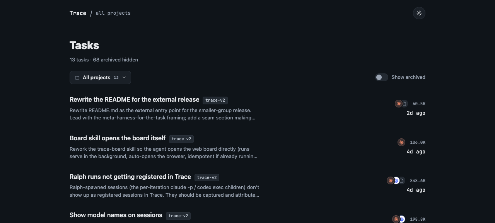
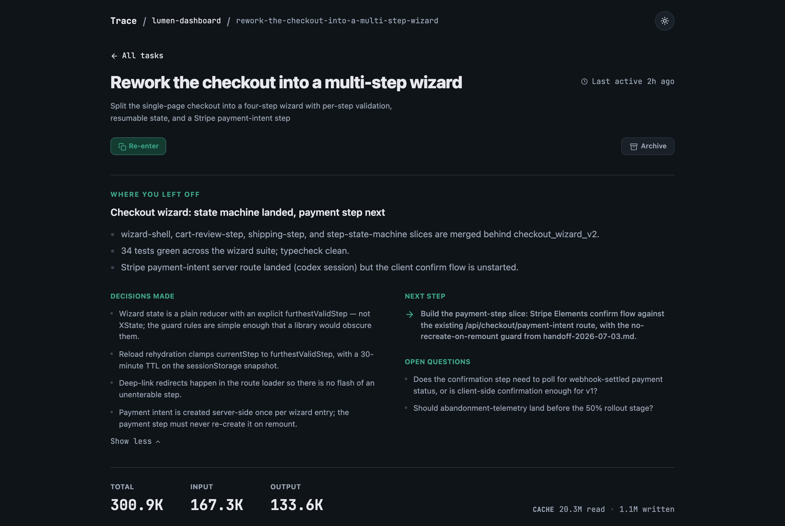
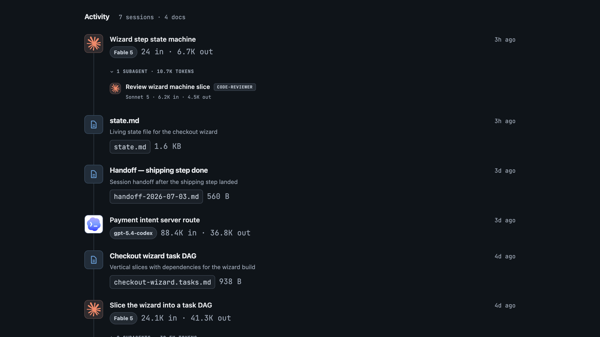

# Trace

**Pick up any piece of work exactly where you left off (in any agent, days
later) without re-explaining it.**

There's a name for the layer this lives in: a _meta-harness_, the layer above
the harness itself, a harness of harnesses. Each coding agent (Claude Code,
Codex, and the rest) is a silo, with its own context and its own runtime, none
of it carrying over when you switch tools or start a new session. A meta-harness
lifts your work out of that silo. (The term comes from Databricks'
[Omnigent](https://www.databricks.com/blog/introducing-omnigent-meta-harness-combine-control-and-share-your-agents):
**Omnigent is a meta-harness for the _session_, the agents running right now;
Trace is a meta-harness for the _task_, the same work carried across sessions,
tools, and days.**)

## The problem

You work on something with an AI agent: you make decisions, write code, build up
a head full of context. Then the session ends. Days later you (or a fresh agent
with an empty memory) come back and have to reconstruct all of it from scrollback
and guesswork.

The mistake is treating the session as the thing that ties your work together. It
doesn't. **Sessions are throwaway; the _task_ is the thread.** A session is where
you build context up and distill it into artifacts, then you can throw it away.
The task is what those artifacts hang off of, and what a new session re-enters.

Trace makes that the default. It records each agent session against a _task_,
gives you a known place to drop decision docs and plans, and lets a brand-new
session reload the whole thread with one sentence:

> Re-enter the checkout flow.

The agent gets back the task, its decision docs, a distilled summary of where you
left off, and pointers to prior sessions, newest first. No pasting transcripts,
no "remind me what we decided."

That's cheaper, too. Re-entering a short summary spends a fraction of the tokens
you'd burn re-pasting a transcript or making a fresh agent re-derive everything
from scrollback, so you get back to work without lighting up your usage.

Trace doesn't care which agent you use. It talks to each one through an adapter,
so a task you start in one session you can re-enter in another, even a different
agent, and everything lands in the same store underneath.

## Trace is a store; the skills are the behaviour

The most common confusion from people seeing Trace for the first time is _where
the intelligence lives_: "is this forcing the agent to save files here?", "is
that a rules file?", "is that loop yours or downloaded?" So:

- **Trace is a store plus surfacing.** It records sessions against tasks, keeps a
  per-task docs directory, and on re-entry surfaces the right context back (the
  state file, the docs, the tail of the last session). That's the whole job:
  _remember, and hand back._
- **The behaviour lives in skills.** Scoping a feature, writing a spec, slicing
  work into tasks, distilling a session into a handoff: that's defined in
  **skills**, which are separate, swappable, and open. Trace doesn't care what a
  skill does; a skill doesn't care how Trace stores things.

**Skills write; Trace remembers.** Keeping that seam sharp is the point: you can
bring your own skills (or the Infinum AI ways-of-working, or whatever comes next)
and Trace still does its one job underneath them.

## What it looks like

The board is a local web UI over the same store: every task, the sessions bound
to it, and the docs attached to it. The per-task token totals are yours to read,
so you can see where your spend actually went, task by task.



Open a task and the first thing you see is where you left off: a short summary,
the decisions you made, the next step, and any open questions. This is exactly
what a fresh session reloads on re-entry, so you start from a briefing instead of
a blank prompt.



Below it sit the token totals and one timeline that doesn't care which tool did
the work. Claude sessions, Codex sessions, and the sub-agents they spin off all
nest the same way (lineage is keyed on the session, not the tool), interleaved
with the docs written along the way.



## How it works

It's a loop:

1. **Say what you're working on.** "We're working on the checkout flow." Trace
   binds the session to a task (creating it if needed) and tells you where the
   task's docs live.
2. **Drop docs where re-entry can find them.** Any spec, plan, or note you write
   into that task's docs directory is associated with the task automatically, with
   no registration step.
3. **Wrap up.** When you're done for the session, Trace distills it into the
   task's living state file, so the next agent reads a summary, not a transcript.
4. **Come back and re-enter.** In a fresh session (tomorrow, next week, a clean
   `/clear`, or a different agent entirely) name the task. The agent reloads the
   state file, the docs, and only if needed the tail of the last session, then
   keeps going.

If you ever start real work in a session that _isn't_ tracked, Trace notices and
offers to bind it, so you don't have to remember to.

## The skills

Trace exposes the loop as focused skills, each firing on one kind of intent so
routing stays predictable. These are the _behaviour_ layer, the part that's yours
to keep or swap:

| Skill                   | Fires when you…                                       | What it does                                                                                                 |
| ----------------------- | ----------------------------------------------------- | ------------------------------------------------------------------------------------------------------------ |
| **trace**               | say you're working on / scoping / defining something  | binds the session to a task (creating it if absent); nudges you when an untracked session is doing real work |
| **trace-reenter**       | name a task by its exact slug or title                | reloads that task's full context from its re-entry manifest                                                  |
| **trace-recall**        | gesture vaguely at past work ("that archiving thing") | figures out _which_ task you mean, then re-enters it                                                         |
| **trace-handoff**       | wrap up, hand off, or start a new chat                | distills the session into the task's living `state.md`                                                       |
| **trace-doc-placement** | write a spec, PRD, plan, or note                      | lands the file in the current task's docs directory                                                          |
| **trace-board**         | ask to open the board                                 | starts the local web UI for browsing tasks                                                                   |

Two front doors resolve a task's _identity_ differently: `trace-reenter` (you
name it exactly) and `trace-recall` (you gesture at it). Both pour into one shared
re-entry core that loads context the same way. How much of this surface an agent
gets depends on the agent: some expose every intent as its own skill, others carry
the whole loop in a single entry skill.

## What's underneath

Trace is a local CLI and a SQLite file, with no model calls of its own, so Trace
itself never spends tokens.

- The **`trace` CLI**, published to npm and resolved per-call by the skills via a
  version-pinned `npx @arielbk/trace@<version>` (no global install, no `PATH`
  setup).
- A **SQLite store** at `~/.trace/trace.sqlite` recording tasks and the sessions
  bound to them.
- **Transcript adapters** (one per agent) that read session transcripts so
  re-entry can surface the tail of a prior session on demand. Supporting a new
  agent means writing an adapter; nothing above it changes.
- **Capture into one store**, either live (where an agent exposes a session-start
  hook) or by backfill (where it doesn't).
- Per-task docs at `~/.trace/tasks/<slug>/docs/`, the known place re-entry looks.

## Setup

Install the agents you use. They share one SQLite store and one re-entry
manifest, so a task is visible from whichever session you re-enter on.

### Claude Code

Trace installs as a Claude Code plugin. From inside Claude Code, add this repo as
a marketplace, then install the plugin (two separate commands):

```sh
/plugin marketplace add arielbk/trace
/plugin install trace@trace
```

The plugin wires up the skills and a `SessionStart` hook that captures each
session live, with no global CLI link or manual settings edit. The skills and
hook invoke the CLI on demand via a version-pinned `npx @arielbk/trace@<version>`,
so there's nothing to build or link. Reload plugins to activate, then ask the
agent to confirm:

```sh
/reload-plugins
```

> Are we currently in a trace session?

The agent should confirm the session is being tracked.

### Codex

Trace installs as a Codex plugin, mirroring Claude. Add this repo as a
marketplace, then install the plugin (two separate commands):

```sh
codex plugin marketplace add arielbk/trace
codex plugin add trace@trace
```

The marketplace source is the repo itself, and Codex installs from the same
canonical skills tree as Claude, so it ships the full skill set (not just
`trace`); each skill invokes the CLI via the same version-pinned
`npx @arielbk/trace@<version>`.
Codex has no live session-start slot, so the skill captures sessions by backfill:
it runs `trace session scan --codex` before it binds or re-enters a task. Same
store, same manifest; just a different capture path.

## Status

Same-tool re-entry (work in an agent, clear, re-enter, keep going) is the core
loop and works today. Cross-tool re-entry rides the shared manifest: a task
worked in one agent can be re-entered from another. The agents supported right
now are **Claude Code** and **Codex**; more are a matter of adding adapters.

---

The rest is for people wiring Trace into their own tooling, and for working on
Trace itself.

## Registering spawned children

A spawner that launches separate child CLI sessions can attribute those children
without knowing anything about Trace internals. Capture each child session id
from the child tool's machine-readable stream, then run:

```sh
trace session set-parent <child-session-id> --parent <parent-session-id> --origin spawned
```

The parent session must already exist in the Trace store. The child may already
exist, or it may be unknown when the command runs. Unknown children are seeded as
virtual Codex sessions with a `codex:<child-session-id>` transcript URI; a later
`trace session register` or Codex scan enriches the row with the real transcript
and tool details without dropping the parent attribution.

For generic spawners, expose a per-child hook named `TRACE_SPAWN_HOOK`. Treat an
unset hook as a no-op. When it is set, substitute `{parent}` and `{child}` with
the captured ids and invoke it exactly once per child:

```sh
TRACE_SPAWN_HOOK='trace session set-parent {child} --parent {parent} --origin spawned'
```

Ralph is the worked example of this contract: it captures Claude children from
`session_id` events and Codex children from `thread.started.thread_id`, records
the `<parent><tab><child>` pair in its own sink, then runs the hook. Any other
spawner can follow the same pattern with its own way of discovering child ids.

## Development

This is a [Turborepo](https://turborepo.dev) monorepo (pnpm workspaces). It
requires **Node 22+** and **pnpm 11**; invoke pnpm via `corepack` so you get the
pinned version regardless of any globally shimmed pnpm.

```sh
corepack pnpm install        # install dependencies
corepack pnpm -r test        # run the test suites (per-package)
corepack pnpm check-types    # typecheck all packages
```

The skill-routing eval (`pnpm eval`) is a separate, quota-costing report that
drives real `claude -p` calls against a sandbox config dir. See
[`evals/README.md`](./evals/README.md) for setup and how to run it.

- `apps/cli`: the `trace` CLI
- `apps/web`: the board (the local web UI)
- `packages/core`: the store, transcript adapters, and re-entry manifest
- `plugin/skills/`: the one canonical skills tree, shared by both hosts. The
  Claude plugin (manifest at `.claude-plugin/plugin.json`) reaches it via the
  nested `./plugin/skills/` path; the Codex plugin roots at `plugin/` itself
  (manifest `plugin/.codex-plugin/plugin.json`, surfaced through
  `.agents/plugins/marketplace.json`) and reads `./skills/`. No generated mirror.
- The only per-host skill, `trace`, is a host-neutral dispatcher
  (`plugin/skills/trace/SKILL.md`) that points at `resources/claude.md` or
  `resources/codex.md` for the host-specific binding flow.

## Releasing

A release publishes one package, `@arielbk/trace`, to npm, and that's the only
thing distributed. The plugins aren't separate artifacts: the skills and the
`SessionStart` hook invoke the CLI through an **exact-pinned**
`npx @arielbk/trace@<version>` (never `@latest`), so a given commit always calls
a known CLI version. The catch is that those pins live in several files (every
`plugin/skills/*/SKILL.md`, the `trace` skill's `resources/codex.md`, and
`hooks/hooks.json`), and they must all move in lockstep with the published
version, or the plugin calls a CLI that doesn't exist yet.

That lockstep is what `release:trace` automates, so **don't hand-edit those
`npx @arielbk/trace@…` pins**. The release script rewrites them and then verifies
every one matches, failing the release on any drift. The pinned files aren't
hand-listed: the release script discovers them by scanning `plugin/skills/**` and
`hooks/` for the `npx @arielbk/trace@…` pin, so a new skill or skill resource is
picked up automatically.

One command does the whole thing: stamp every pin (plus `apps/cli/package.json`
and the Codex plugin manifest), build the web UI and the CLI, `npm pack`, and
publish:

```sh
# Always dry-run first: stamps, builds, packs, and runs `npm publish --dry-run`
corepack pnpm release:trace -- --bump patch --dry-run

# Real publish (drop --dry-run). Requires npm auth for the @arielbk scope.
corepack pnpm release:trace -- --bump patch
```

Pick the version with either `--bump patch|minor|major` (computed from the
current `apps/cli/package.json`) or `--version x.y.z` for an explicit one, not
both. A real publish needs write access to the `@arielbk` npm scope configured in
your `~/.npmrc`; published versions are immutable, so let the dry-run pass before
dropping the flag.
